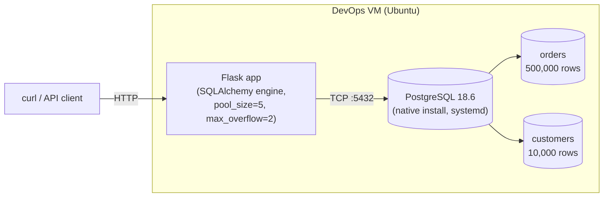
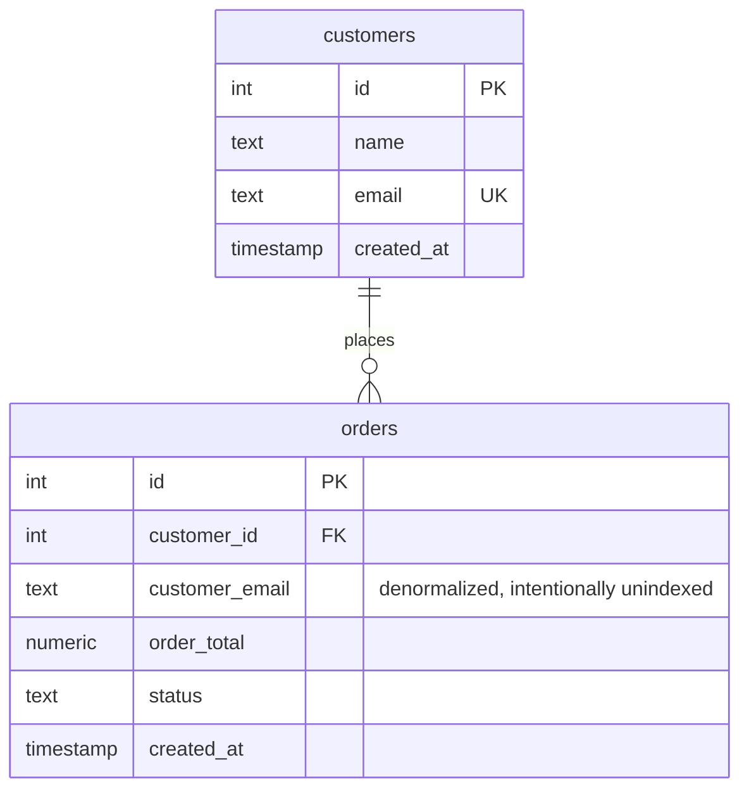

# Database Performance Incident Lab

A hands-on PostgreSQL administration project: stand up a real database backend for a Flask app, then run two realistic, self-inflicted production incidents through the full **break → detect → diagnose → fix → verify** cycle — a missing-index slow query and a connection-pool exhaustion. Built to close the "Database Administration" gap in a broader 90-day IT/DevOps skills roadmap covering Linux, Windows/AD, AWS/Azure, Terraform, Ansible, Kubernetes, observability, and networking.

## Architecture



PostgreSQL is installed **natively** on the VM via `apt` (not containerized) and run as a systemd service (`postgresql@18-main.service`) — deliberately different from the Docker-based approach used in other projects in this series, to demonstrate real service administration: `systemctl`, role/privilege management, and per-database configuration.

## Schema



`orders.customer_email` is a **denormalized** copy of the customer's email, not a join — a deliberate choice so the missing-index incident is a clean single-table story, and a realistic one: read-heavy systems denormalize for performance all the time, which is exactly what makes forgetting the index such a common real-world mistake.

## What was built

- PostgreSQL 18.6 installed and configured natively on an existing Ubuntu VM, including a dedicated least-privilege application role (`app_user` — no superuser, no createdb, no createrole) owning its own database, mirroring the IAM least-privilege pattern used elsewhere in this project series.
- A `customers`/`orders` schema seeded with 10,000 customers and 500,000 orders via a bulk-loading Python script.
- A Flask app (`app.py`) connecting through SQLAlchemy with a deliberately small, realistic connection pool (`pool_size=5, max_overflow=2, pool_timeout=10`), exposing endpoints for order lookups and a health check.
- Two full incident simulations, each independently broken, diagnosed with the correct real-world tool, fixed, and verified recovered.

## Incident A — Missing index (slow query)

**Symptom:** `GET /orders/by-email/<email>` — a query filtering 500,000 rows on an unindexed column — was measurably slow.

| | Before | After |
|---|---|---|
| Query plan | `Seq Scan on orders` (full table scan) | `Bitmap Index Scan` using new index |
| `EXPLAIN ANALYZE` execution time | 30.636 ms | 2.248 ms |
| API round-trip (Flask) | 53.6 ms | 5.5 ms |
| Improvement | — | **~13.6x faster query, ~9.7x faster end-to-end** |

**Diagnosis tool:** `EXPLAIN ANALYZE` — confirmed a full sequential scan removing 499,951 rows to find 49 matches.

**Fix:** `CREATE INDEX idx_orders_customer_email ON orders (customer_email);`

One extra wrinkle worth calling out: PostgreSQL's automatic query parallelism initially made the "slow" baseline deceptively fast (~17ms, using 2 parallel workers), which would have understated the real cost of the missing index in the writeup. Forcing a single-threaded scan (`ALTER DATABASE ... SET max_parallel_workers_per_gather = 0`) surfaced the honest 30.636ms baseline — parallel workers can mask a genuinely bad query plan, which is itself a useful thing to know when tuning queries.

## Incident B — Connection pool exhaustion

**Symptom:** A new "reporting" endpoint (`/reports/leaky-summary`) opened a database connection but never returned it to the pool — invisible on a single test call, but after 7 requests (exactly `pool_size=5 + max_overflow=2`), the 8th request onward hung for the full 10-second pool timeout and then failed with a 500 error.

**Diagnosis tool:** `pg_stat_activity` — showed 7 connections from `app_user`, all sitting in `idle in transaction`, each `state_change` timestamp lining up exactly with the load test. (Notably worse than a plain idle leak — an open transaction can also hold locks in a real production system.)

**Root cause:** the endpoint called `engine.connect()` directly instead of using it as a context manager, so the connection was never guaranteed to be released — even on the success path, let alone on an exception.

**Fix:**
```python
# Before (leaks a connection every call)
conn = engine.connect()
count = conn.execute(text("SELECT count(*) FROM orders")).scalar()
return jsonify(order_count=count)

# After (connection always returned to the pool)
with engine.connect() as conn:
    count = conn.execute(text("SELECT count(*) FROM orders")).scalar()
return jsonify(order_count=count)
```

**Verification:** re-ran the same load pattern for 15 requests (double the original failure point) — all 15 returned `200` in ~25-30ms each, no hangs, no errors. `pg_stat_activity` afterward showed a healthy 1-2 connections, none stuck in `idle in transaction`.

## Skills demonstrated

- Native PostgreSQL installation and administration (systemd service management, role/privilege configuration, per-database settings)
- Query performance diagnosis and tuning via execution-plan analysis (`EXPLAIN ANALYZE`)
- Index design and its measured impact on query performance
- Connection-pool architecture, exhaustion diagnosis via `pg_stat_activity`, and root-cause code remediation
- Realistic incident-response methodology: baseline → break → diagnose with the correct tool → fix the actual root cause → verify recovery
- Flask/SQLAlchemy application integration with a production-style database backend

## Lessons learned

- PostgreSQL's automatic query parallelism can make a genuinely bad query plan look fast in a demo/test — worth explicitly checking single-threaded cost (`max_parallel_workers_per_gather = 0`) when evaluating whether an index is actually needed.
- `idle in transaction` connections in `pg_stat_activity` are a more serious finding than plain `idle` — they can hold open locks, not just a wasted connection slot.
- Bulk-loading large datasets should use true multi-row `INSERT ... VALUES (...),(...)` (e.g. `psycopg2.extras.execute_values`), not row-by-row `executemany` — the difference was the gap between a seed script finishing in under a minute versus taking long enough to look hung.
- A connection leak doesn't need concurrency to prove — hitting a leaking endpoint sequentially enough times exhausts a small pool just as reliably as concurrent load, since each unreturned connection permanently reduces the pool.
- Ubuntu desktop images used as VM guests can have automatic suspend enabled by default, which fully freezes the VM (including SSH) after sitting idle — worth masking at setup time (`systemctl mask sleep.target suspend.target hibernate.target hybrid-sleep.target`) before it costs an interrupted session.
- Appending code to a Python file with `cat >>` places it at the literal end of the file — if that's after a blocking call like `app.run()`, the appended code never executes even though it's sitting right there in the file. New routes need to go before the entry-point block.

## Resume bullets

- Installed and administered PostgreSQL natively on a Linux VM, including systemd service management and least-privilege role/database configuration, backing a Flask/SQLAlchemy application.
- Diagnosed a slow-query production incident using `EXPLAIN ANALYZE` on a 500,000-row table, identified a missing index as root cause, and resolved it with a 13.6x reduction in query execution time (30.6ms → 2.2ms) and 9.7x reduction in end-to-end API latency.
- Diagnosed a connection-pool exhaustion incident using PostgreSQL's `pg_stat_activity`, identifying a code-level connection leak (`idle in transaction` sessions) as root cause, and resolved it by fixing the application's connection-lifecycle handling — verified via load testing at 2x the original failure threshold with zero errors.
- Designed and executed a two-incident database performance lab following a full break/detect/diagnose/fix/verify methodology, mirroring real production on-call troubleshooting.

## Repo structure

```
database-performance-lab/
├── README.md
├── docs/
│   └── incident-writeup.md
├── screenshots/
├── app.py
├── seed.py
├── requirements.txt
└── .gitignore
```
